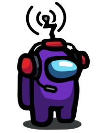

[![GitHub Downloads][github-shield]][github-url] [![GPL-3.0 License][license-shield]][license-url] [![Appveyor Build][appveyor-shield]][appveyor-url] [![Support BetterCrewLink][paypal-shield]][paypal-url] [![Discord Server][discord-shield]][discord-url]

<br />
<p align="center">
  <a href="https://github.com/OhMyGuus/BetterCrewLink">
    
  </a>
  <h3 align="center">BetterCrewLink a CrewLink fork with extra features & better support</h3>


  <p align="center">
    Free, open, Among Us proximity voice chat.
    <br />
    <a href="https://github.com/OhMyGuus/BetterCrewLink/issues">Report Bug</a>
    ·
    <a href="https://github.com/OhMyGuus/BetterCrewLink/issues">Request Feature</a>
    ·
    <a href="#installation">Installation Instructions</a>
  </p>
  <p align="center">
    <b><a href="https://www.paypal.com/donate?hosted_button_id=KS43BDTGN76JQ">Donate to BetterCrewLink</a></b></br>
  (all donations will be used for the apple developer license and extra servers)</br>
   <b><a href="https://paypal.me/ottomated">Donate to ottomated (offical CrewLink)</a></b>
  </p>
</p>
<hr />

<p>

<!-- NOTES -->
<b>Notes:</b><br />

- This is an unofficial fork of CrewLink, for any problem, issue or suggestion you have with BetterCrewLink talk to us on our [Discord](https://discord.gg/qDqTzvj4SH), or [GitHub](https://github.com/OhMyGuus/BetterCrewLink/issues) or message me on Discord ([ThaGuus#2140](https://discordapp.com/users/508426414387757057)) do not report any problems to the official Discord or GitHub project of CrewLink as they will not support you.

- To get the most of BetterCrewLink use the voice server: <a href="https://bettercrewl.ink">`https://bettercrewl.ink`</a>

</p>
<a href="https://discord.gg/qDqTzvj4SH">  </a>

<!-- TABLE OF CONTENTS -->
## Table of Contents

* [Extra features/fixes in this fork](#extra-featuresfixes-in-this-fork)
* [About the Project](#about-the-project)
* [Installation](#installation)
  * [Windows](#windows)
  * [Linux](#linux)
  * [Android](#android)
  * [iOS](#ios)
* [Development](#development)
  * [Prerequisites](#prerequisites)
  * [Setup](#setup)
* [Contributing](#contributing)
  * [Contributors](#contributors)
* [License](#license)

<!-- EXTRA FEATURES-->
## Extra features/fixes in this fork
```
- OBS browsersource overlay.
- Hear people in vision only.
- Walls block audio. 
- Volume sliders.
- It doesn't break when someone leaves/disconnects.
- It works on any network even with UPnP disabled. (Strict NAT)
- More fun settings like hearing through cameras.
- You can actually disable the overlay.
- 32bit support, windows 7 support.
- You can change the volume of alive players after you died.
- You can set BetterCrewLink to topmost.
- Settings actually sync between players and not half.
- CPU usage is lower than original CrewLink.
- You can actually press the mute key/deafen key while clicked on BetterCrewLink.
- Your mouse doesn't start to lag because of the buggy input hook.
- Changing the speaker setting does actually something unlike original CrewLink where it is always using the default output.
- Compatible with CrewLink 2.0 
- Microphone echo cancellation.
- Microphone noise suppression.
- More overlay positions and you can set the overlay to the top/bottom and you can set it so it shows everyone even when they aren't talking.
- You can set the lobby up so only death people can talk. (normal lobbies but then with death talk)
- Support for new version of Among Us. (v2021.3.31.3 and v2021.4.1)
- Support for custom colors. (mods that add more colors)
- Support for Linux. (BETA)
- Support for mobile. (BETA)
```

**If I missed something you can join in [Discord server](https://discord.gg/qDqTzvj4SH), or in [GitHub](https://github.com/OhMyGuus/BetterCrewLink/issues) or DM me on Discord ([ThaGuus#2140](https://discordapp.com/users/508426414387757057)) it so I can add it**

<!-- ABOUT THE PROJECT -->
## About The Project

This project implements proximity voice chat in Among Us. Everyone in an Among Us lobby with this program running will be able to communicate over voice in-game, with no third-party programs required. Spatial audio ensures that you can only hear people close to you.

<!-- INSTALLATION -->
## Installation

## Windows

Download the latest version from [releases](https://github.com/OhMyGuus/BetterCrewLink/releases/latest) and run the `BetterCrewLink-Setup-X.X.X.exe` file. You may get antivirus warnings, because this program hooks into the Among Us process to read game data.

## Linux

To install & run it on Linux run the following commands: 
```wget "https://mirror.bettercrewl.ink/pc/latest/BetterCrewlink-Linux.AppImage"
chmod +x BetterCrewlink-Linux.AppImage
echo 0 | sudo tee /proc/sys/kernel/yama/ptrace_scope
./BetterCrewlink-Linux.AppImage
```
The Linux version is thanks to the following contributors: 

- [TheGreatMcPain](https://github.com/TheGreatMcPain) -> Crewlink fork, Keyboard watcher fork, memoryjs fork
- [zbanks](https://github.com/zbanks) -> Memoryjs fork
- [Donokami](https://github.com/Donokami) -> Testing and helping  

## Android

Go to category [Installation](https://github.com/OhMyGuus/BetterCrewlink-mobile#installation) in BetterCrewlink-mobile to see how to install the Android version. (requires a PC player)

## iOS

An iOS version is still being developed and will be released soon but you can use the [web version](https://web.bettercrewl.ink/). (requires a PC player)

<!-- SETUP INSTRUCTIONS -->
### Setup Instructions (click)

[](https://www.youtube.com/watch?v=_8F4f5iQEIc "CrewLink Setup Instructions")

<!-- DEVELOPMENT -->
## Development

You only need to follow the below instructions if you are trying to modify this software. Otherwise, please download the latest version from the [github releases](https://github.com/OhMyGuus/BetterCrewLink/releases).

Server code is located at [OhMyGuus/BetterCrewLink-server](https://github.com/OhMyGuus/BetterCrewLink-server). Please use a local server for development purposes.

### Prerequisites

This is an example of how to list things you need to use the software and how to install them.
* [Python](https://www.python.org/downloads/)
* [node.js](https://nodejs.org/en/download/)
* yarn
```sh
npm install yarn -g
```

### Setup

1. Clone the repo
```sh
git clone https://github.com/OhMyGuus/BetterCrewLink.git
cd BetterCrewLink
```
2. Install NPM packages
```sh
yarn install
```
3. Run the project
```JS
yarn dev
```

<!-- CONTRIBUTING -->
## Contributing

Any contributions you make are greatly appreciated.

1. [Fork the Project](https://github.com/OhMyGuus/BetterCrewLink/fork)
2. Create your Feature Branch (`git checkout -b feature/AmazingFeature`)
3. Commit your Changes (`git commit -m 'Add some AmazingFeature'`)
4. Push to the Branch (`git push origin feature/AmazingFeature`)
5. Open a Pull Request

## Contributors

Since GitHub does not allow you to have a list of project contributors with a fork, so I decided to make my own for the people who help the project, to be remembered with their credits.

* [OhMyGuus](https://github.com/OhMyGuus) for make various things for [BetterCrewLink](https://github.com/OhMyGuus/BetterCrewLink), example: NAT Fix, more overlays, support for Mobile and owner of project
* [ottomated](https://github.com/ottomated) for make [CrewLink](https://github.com/ottomated/CrewLink)
* [vrnagy](https://github.com/vrnagy) for make WebRTC reconnects automatically for [BetterCrewLink](https://github.com/OhMyGuus/BetterCrewLink)
* [TheGreatMcPain](https://github.com/TheGreatMcPain) & [Donokami](https://github.com/Donokami) for make support for Linux
* [squarebracket](https://github.com/squarebracket) for make support overlay for Linux
* [JKohlman](https://github.com/JKohlman) for make various things for [BetterCrewLink](https://github.com/OhMyGuus/BetterCrewLink), example: push to mute, visual changes and making Multi Stage builds for [BetterCrewLink Server](https://github.com/OhMyGuus/BetterCrewLink-server)
* [Diemo-zz](https://github.com/Diemo-zz) for make the default Voice Server for: <a href="https://bettercrewl.ink">`https://bettercrewl.ink`</a>
* [KadenBiel](https://github.com/KadenBiel) for make various things for [BetterCrewLink Mobile](https://github.com/OhMyGuus/BetterCrewlink-mobile), example: Better UI, Settings page
* [adofou](https://github.com/adofou) for make new parameters for node-turn server for [BetterCrewLink-Server](https://github.com/OhMyGuus/BetterCrewLink-server)
* [Kore-Development](https://github.com/Kore-Development) for make support for Repl.it and gitignore changes for [BetterCrewLink-Server](https://github.com/OhMyGuus/BetterCrewLink-server)
* [cybershard](https://github.com/cybershard) & [edqx](https://github.com/edqx) for make Only hear people in vision, Walls block voice and Hear through cameras
* [electron-overlay-window](https://github.com/SnosMe/electron-overlay-window) for make it easier to do overlays
* [node-keyboard-watcher](https://github.com/OhMyGuus/node-keyboard-watcher) for make it easy to push to talk and push to mute
* [MatadorProBr](https://github.com/MatadorProBr) for make this list of Contribuators, better README.md, wiki

A big thank you to all those people who contributed and still contribute to this project to stay alive, thank you for being part of this BetterCrewLink community!

<!-- LICENSE -->
## License

Distributed under the GNU General Public License v3.0. See <a href="https://github.com/OhMyGuus/BetterCrewLink/blob/nightly/LICENSE">`LICENSE`</a> for more information.

[github-shield]: https://img.shields.io/github/downloads/OhMyGuus/BetterCrewLink/total?label=Downloads
[github-url]: https://github.com/OhMyGuus/BetterCrewLink/releases/
[license-shield]: https://img.shields.io/github/license/OhMyGuus/BetterCrewLink?label=License
[license-url]: https://github.com/OhMyGuus/BetterCrewLink/blob/nightly/LICENSE
[appveyor-shield]: https://img.shields.io/appveyor/build/OhMyGuus/bettercrewlink?label=Build
[appveyor-url]: https://ci.appveyor.com/project/OhMyGuus/bettercrewlink
[paypal-shield]: https://img.shields.io/badge/Support-BetterCrewLink-purple
[paypal-url]: https://www.paypal.com/donate?hosted_button_id=KS43BDTGN76JQ
[discord-shield]: https://img.shields.io/discord/791516611143270410?color=cornflowerblue&label=Discord&logo=Discord&logoColor=white
[discord-url]: https://discord.gg/qDqTzvj4SH
